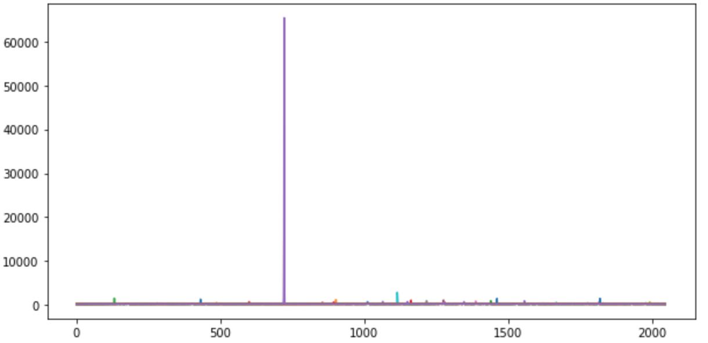
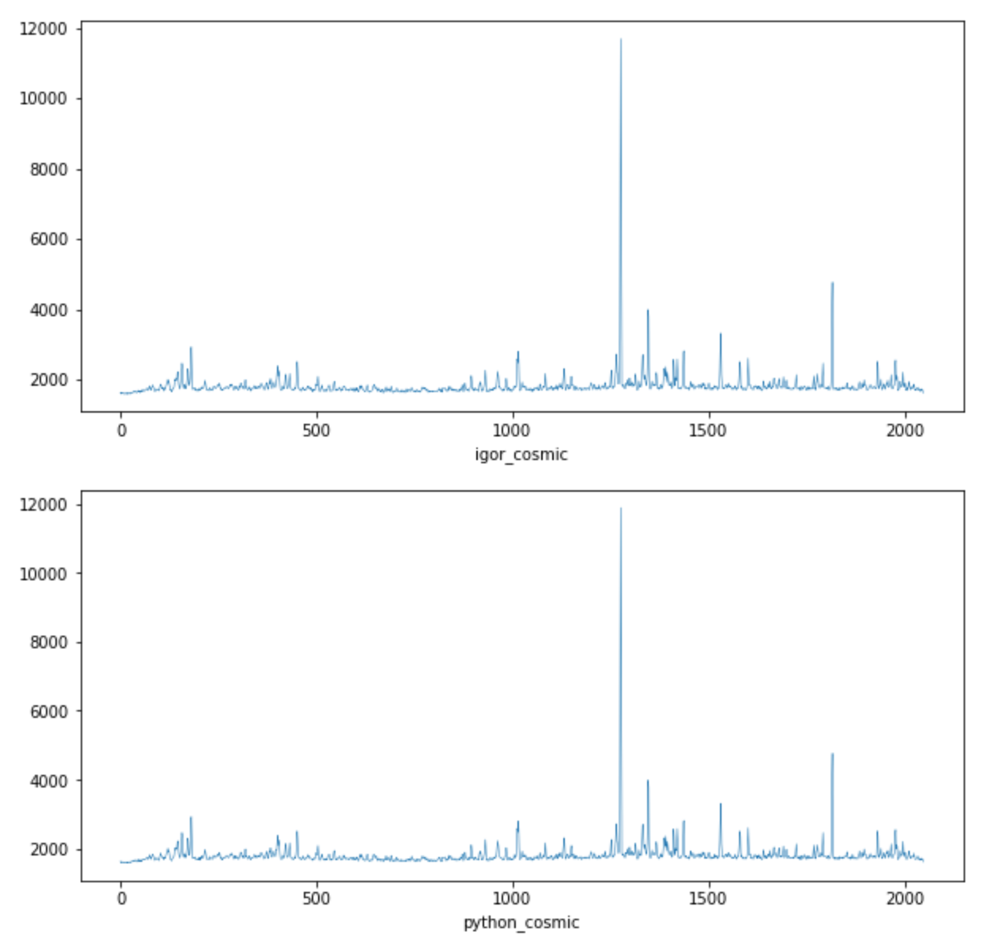
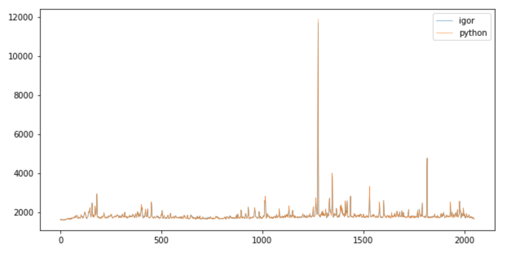

## Cosmic Ray Filter

A cosmic ray filter must be applied to the output files, this was previously done with an IgorPro script. There are two result files
in this folder:

1. **EUV053_150p1mA_1D15_4p10KV_60s_15sdump_Mo_09162015.SPE** - A spectrum with no filter applied.

2. **EUV53_cosmic.txt** - Spectrum with filter applied in IgorPro.

After writing a cosmic ray filter in python, although not the same results as the one with the IgorPro script but close enough.

Before filter:

Profiles side by side after filter applied:

Profiles on the same plot after filter applied:

